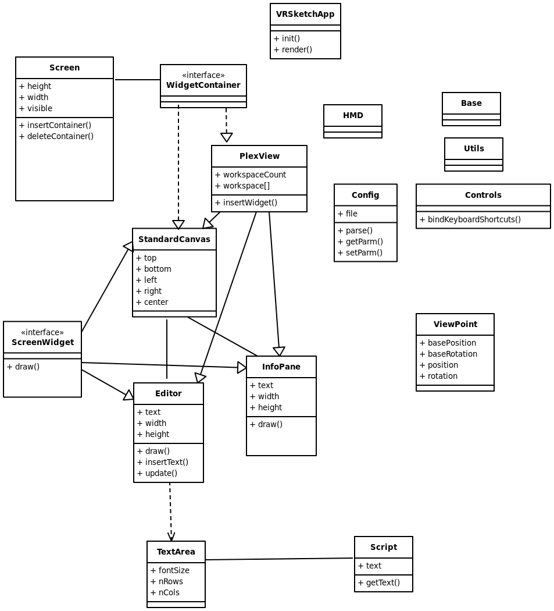

# VRSketch
#research implementation of RiftSketch
 
# UML class diagram (preliminary):
# 
 
# Note: may have to run 'npm init' the first you download this image 
This project is generated with [yo angular-require generator](https://github.com/aaronallport/generator-angular-require)
version 1.0.0.

## Build & development

Run `grunt` for building and `grunt serve` for preview.

## Testing

Running `grunt test` will run the unit tests.

run 'grunt karma' to do karma jasmine unit tests.
